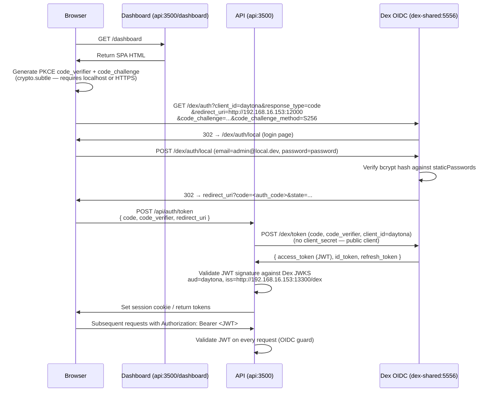
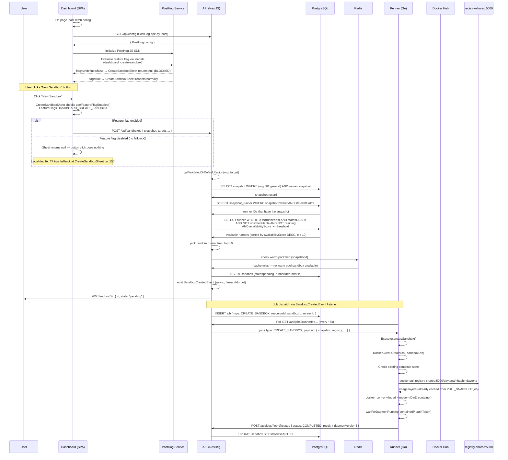
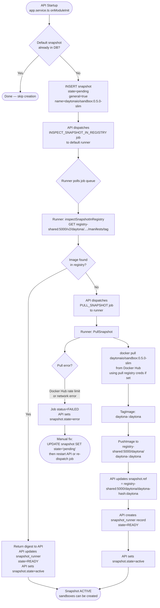
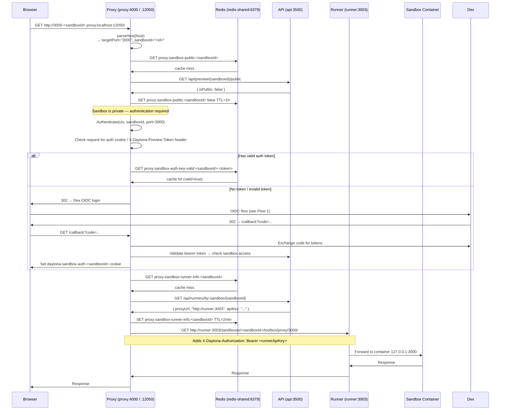
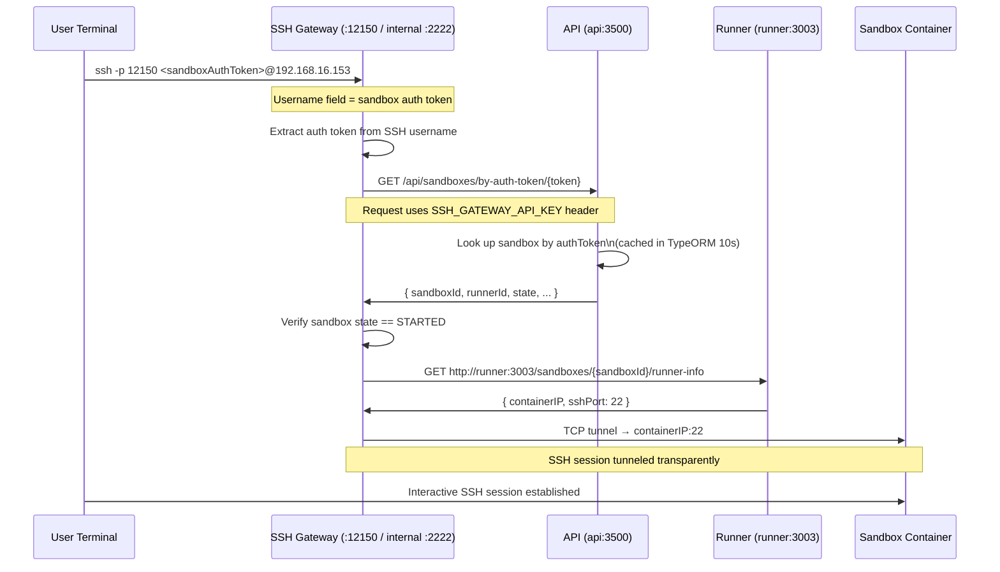
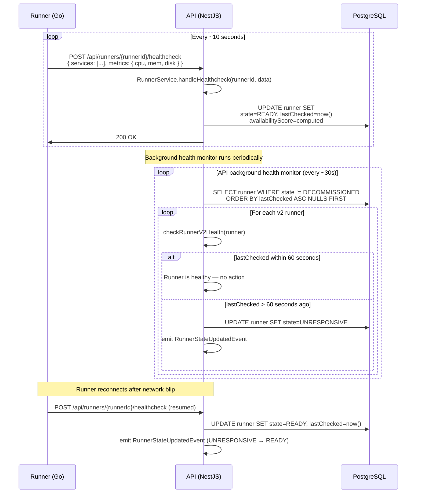
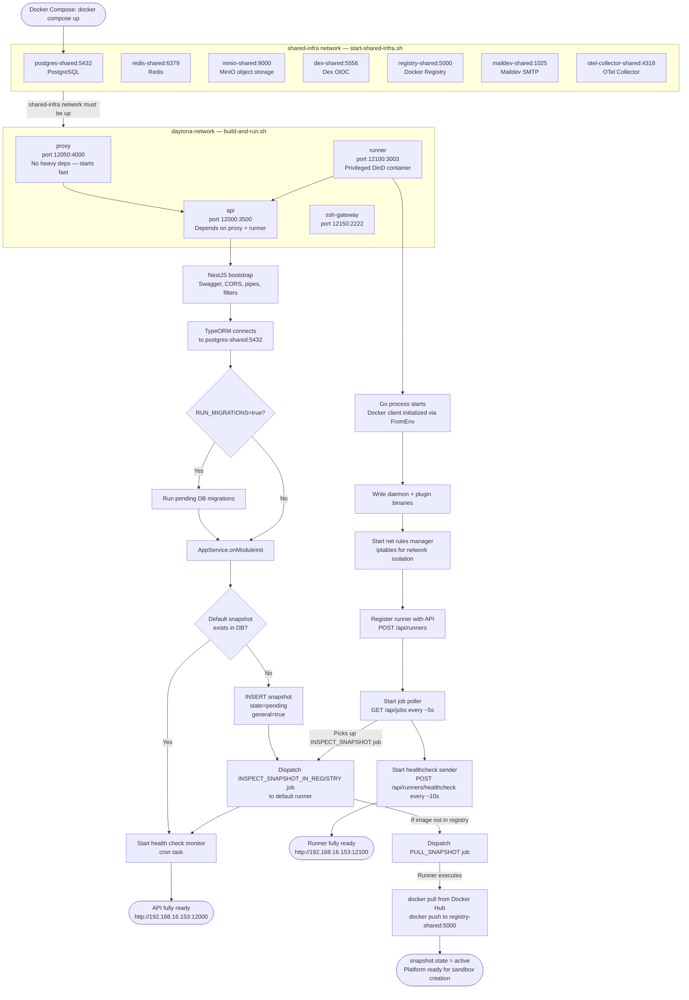

# Daytona Platform — Flow Diagrams

**Local dev environment:**
- WSL2 host: `192.168.16.153`
- API: `http://192.168.16.153:12000` (internal `api:3500`)
- Proxy: `http://192.168.16.153:12050` (internal `proxy:4000`)
- Runner: `http://192.168.16.153:12100` (internal `runner:3003`)
- SSH Gateway: port `12150` (internal `2222`)
- Dex (OIDC): `http://192.168.16.153:13300/dex` (internal `dex-shared:5556`)
- PostgreSQL: `postgres-shared:5432`
- Redis: `redis-shared:6379`
- MinIO: `minio-shared:9000`
- Registry: `registry-shared:5000`

---

## Table of Contents

1. [Flow 1: OIDC Login Flow](#flow-1-oidc-login-flow)
2. [Flow 2: Sandbox Creation Flow](#flow-2-sandbox-creation-flow)
3. [Flow 3: Snapshot Lifecycle Flow](#flow-3-snapshot-lifecycle-flow)
4. [Flow 4: Sandbox Proxy / Preview Access Flow](#flow-4-sandbox-proxy--preview-access-flow)
5. [Flow 5: SSH Access to Sandbox](#flow-5-ssh-access-to-sandbox)
6. [Flow 6: Runner Health Check Loop](#flow-6-runner-health-check-loop)
7. [Flow 7: Service Startup and Initialization Order](#flow-7-service-startup-and-initialization-order)

---

## Flow 1: OIDC Login Flow

### Diagram



### Step-by-Step Explanation

1. **Browser loads the Dashboard SPA.** The Dashboard is served by the API container itself at `http://192.168.16.153:12000/dashboard`. It is a React single-page app.

2. **PKCE challenge generation.** Before redirecting to Dex, the SPA generates a random `code_verifier` (high-entropy random string) and derives the `code_challenge` from it via SHA-256 using `crypto.subtle`. **Gotcha:** `crypto.subtle` is only available in a [secure context](https://developer.mozilla.org/en-US/docs/Web/Security/Secure_Contexts), meaning the browser must access the app via `https://` or `http://localhost`. If you access via `http://192.168.16.153:12000` directly, the PKCE step will throw a `crypto.subtle is undefined` error. Use `http://localhost:12000` instead, or add an SSL terminator.

3. **Authorization request to Dex.** The SPA redirects the browser to Dex's authorization endpoint with the PKCE challenge, `client_id=daytona`, and `response_type=code`. No client secret is involved because the `daytona` client is declared as `public: true` in `shared-infra/dex/config.yaml`.

4. **Dex login page.** Dex serves its own login page at `/dex/auth/local`. In local dev, `enablePasswordDB: true` enables username/password authentication using `staticPasswords`. The only pre-configured user is `admin@local.dev` / `password`.

5. **Credential verification.** Dex verifies the submitted password against the bcrypt hash stored in `config.yaml`. To add more users, generate a bcrypt hash with `htpasswd -bnBC 10 "" yourpassword | tr -d ':\n'` and add a new entry.

6. **Authorization code redirect.** Dex redirects back to the configured `redirect_uri` (either `http://192.168.16.153:12000` or `http://localhost:12000` — both are whitelisted) with a short-lived authorization `code` and the original `state` parameter.

7. **Token exchange.** The API (acting as the OAuth2 client on behalf of the SPA) sends the authorization code plus the original `code_verifier` to Dex's `/dex/token` endpoint. Because the client is public, no client secret is required — Dex verifies integrity via the PKCE mechanism.

8. **JWT issuance.** Dex returns a JWT `access_token` (and `id_token`). The JWT's `iss` claim is `http://192.168.16.153:13300/dex` and `aud` is `daytona`.

9. **API-side JWT validation.** The API validates the JWT signature against Dex's JWKS endpoint on every incoming request. The OIDC guard checks `iss`, `aud`, expiry, and signature. The API connects to Dex internally via `http://dex-shared:5556/dex` (`OIDC_ISSUER_BASE_URL` env var), but the JWT's `iss` claim uses the public URL (`PUBLIC_OIDC_DOMAIN`).

10. **Session established.** After validation, the API creates or updates the user record in PostgreSQL and returns the session to the browser. Subsequent API calls include `Authorization: Bearer <JWT>` in the header.

### Gotchas

- `crypto.subtle` requires a secure context. Always use `http://localhost:12000`, not the WSL2 IP, unless you add TLS.
- The `PUBLIC_OIDC_DOMAIN` env var in `docker-compose.local.yaml` must match the `iss` embedded in Dex JWTs (the `issuer:` field in `dex/config.yaml`). Mismatch → 401 on every request.
- Dex stores its state in a SQLite file (`/var/lib/dex/dex.db`) inside the container. This is ephemeral unless you mount a volume. Restart Dex → all sessions are invalidated.
- `allowedOrigins` in `dex/config.yaml` controls CORS for Dex's own endpoints. Ensure `http://192.168.16.153:12000` is listed if you test from the WSL2 IP.

---

## Flow 2: Sandbox Creation Flow

### Diagram



### Step-by-Step Explanation

**Step 0 (Dashboard Init): PostHog Feature Flag Gate**

- On page load, the dashboard fetches config from `GET /api/config` which includes PostHog `apiKey` and `host`.
- The dashboard initializes the PostHog JS SDK and evaluates the feature flag `dashboard_create-sandbox` via PostHog's `/decide` endpoint.
- The `CreateSandboxSheet` component checks `useFeatureFlagEnabled(FeatureFlags.DASHBOARD_CREATE_SANDBOX)`.
- If the flag returns `undefined` or `false` (e.g., not enabled in PostHog for local/docker-compose environments), the sheet component returns `null`. The "New Sandbox" button appears but clicking it does nothing.
- **Local dev fix:** `apps/dashboard/src/components/Sandbox/CreateSandboxSheet.tsx:150` uses a `?? true` fallback to default the flag to enabled when PostHog hasn't decided.

1. **API receives the creation request.** `POST /api/sandboxes` hits `SandboxController`, which calls `SandboxService.createFromSnapshot()`. The request body includes `snapshot` (name or UUID), `target` (region), resource params, env vars, labels.

2. **Region resolution.** `getValidatedOrDefaultRegion(organization, target)` validates the requested region or falls back to the `DEFAULT_REGION_ID` (`us` in local dev). Region must exist in the `region` table.

3. **Snapshot lookup.** The service queries the `snapshot` table for records matching the name/UUID where either `organizationId` matches or `general=true`. If multiple rows match, the one with `state=ACTIVE` is preferred. If none is ACTIVE, the request fails with a 400 error. The snapshot must also have a non-null `ref` field (the image reference in the registry).

4. **Regional availability check.** `snapshotService.isAvailableInRegion(snapshot.id, region.id)` queries the `snapshot_runner` table to verify at least one runner in the target region has the snapshot in `READY` state.

5. **Runner selection via `findAvailableRunners()`.** The service queries `snapshot_runner` for all runner IDs that have `snapshotRef=snapshot.ref` and `state=READY`. It then filters the `runner` table: `state=READY`, `unschedulable=false`, `draining=false`, `availabilityScore >= threshold` (default 10, from `RUNNER_AVAILABILITY_SCORE_THRESHOLD`). Results are sorted by `availabilityScore` descending and capped at 10 candidates. One is chosen at random from this list (load balancing across healthy runners).

6. **Warm pool check.** If no volumes are requested, the service checks Redis for a `warm-pool:skip:{snapshotId}` key. If absent, it tries `warmPoolService.fetchWarmPoolSandbox()` — a pre-created sandbox that can be immediately assigned. If a warm pool sandbox is found, the entire creation shortcut happens via `assignWarmPoolSandbox()` and the flow ends here.

7. **Quota validation.** `validateOrganizationQuotas()` checks CPU/memory/disk against the org's quota limits. Pending increments are tracked so they can be rolled back if a later step fails.

8. **Sandbox DB record insertion.** A `Sandbox` entity is constructed with `pending=true`, `runnerId=runner.id`, and inserted into the `sandbox` table. A `SandboxCreatedEvent` is emitted asynchronously (fire-and-forget). The API immediately returns the sandbox DTO to the caller — the sandbox is now in `pending` state.

9. **Job dispatch.** The `SandboxCreatedEvent` listener inserts a `CREATE_SANDBOX` job into the `job` table targeting the chosen runner.

10. **Runner polls for jobs.** The runner polls `GET /api/jobs` every ~5 seconds. It receives the `CREATE_SANDBOX` job with a payload containing the snapshot reference and registry credentials.

11. **Runner creates the container.** `Executor.createSandbox()` → `DockerClient.Create()`. The function first checks if the container already exists (idempotency). It pulls the image from `registry-shared:5000` (the internal registry where `PULL_SNAPSHOT` pre-staged it), then runs a privileged Docker-in-Docker container.

12. **Daemon readiness wait.** After the container starts, `waitForDaemonRunning(containerIP, authToken)` polls the container's internal daemon (port 2280) until it responds. This confirms the sandbox is fully ready.

13. **Job completion.** The runner posts `COMPLETED` to the job endpoint. The API event handler updates `sandbox.state = STARTED`.

### Key DB Tables

| Table | Role |
|---|---|
| `snapshot` | Snapshot metadata, `state`, `ref` (registry image ref), `general` flag |
| `snapshot_runner` | Junction: which runner has which snapshot (`state=READY` = image is in local registry) |
| `sandbox` | Sandbox records, `state`, `runnerId`, `pending` flag |
| `runner` | Runner records, `state`, `availabilityScore`, `unschedulable`, `draining` |
| `job` | Async job queue; polled by runners |

### Gotchas

- **PostHog feature flag blocks sandbox creation:** If the "New Sandbox" button click does nothing (no sheet opens, no API request logged), check that the PostHog feature flag `dashboard_create-sandbox` is enabled. In local dev environments, the flag is typically disabled by default. The fix is the `?? true` fallback in `apps/dashboard/src/components/Sandbox/CreateSandboxSheet.tsx:150`, which defaults the flag to enabled when PostHog hasn't decided.
- If `findAvailableRunners` returns an empty list, the API throws a 503. Root cause is almost always that `snapshot_runner.state` is not `READY` — the `PULL_SNAPSHOT` job hasn't completed yet, or completed with an error.
- The `availabilityScore` threshold (env `RUNNER_AVAILABILITY_SCORE_THRESHOLD=10`) gates runner selection. A runner that just started may have score 0 and be invisible to the scheduler until health checks raise its score.
- `pending=true` is a transient flag; if the API crashes after DB insert but before job dispatch, the sandbox is stuck `pending`. Clean up with `UPDATE sandbox SET pending=false WHERE state='pending'`.

---

## Flow 3: Snapshot Lifecycle Flow

### Diagram



### Step-by-Step Explanation

1. **API `onModuleInit` hook.** When the API NestJS application starts, `AppService.onModuleInit()` runs. It checks whether the default snapshot (`daytonaio/sandbox:0.5.0-slim`, from `DEFAULT_SNAPSHOT` env var) already exists in the `snapshot` table for the admin organization.

2. **Snapshot record creation.** If not found, `snapshotService.createFromPull()` inserts a new snapshot record with `state=pending`, `general=true` (available to all organizations), and the image name as both `name` and `imageName`.

3. **INSPECT job dispatch.** After inserting the snapshot, the API dispatches an `INSPECT_SNAPSHOT_IN_REGISTRY` job to the default runner. This is a lightweight check: the runner calls the registry's HTTP API to see if the image already exists in `registry-shared:5000`. This matters on repeated API restarts — the image may already be cached from a previous session.

4. **Registry inspection.** The runner queries the registry manifest endpoint. If the digest response succeeds, the image is already present. The API updates `snapshot_runner.state=READY` and sets `snapshot.state=active`. The lifecycle is complete.

5. **PULL_SNAPSHOT job.** If the registry doesn't have the image, the API dispatches a `PULL_SNAPSHOT` job. The runner's `PullSnapshot()` function is called.

6. **Docker Hub pull.** `DockerClient.PullImage(ctx, "daytonaio/sandbox:0.5.0-slim", registry, nil)` performs a `docker pull` from Docker Hub. Registry credentials (for private images) are passed via the `Registry` struct in the job payload. Public images need no credentials.

7. **Tag for internal registry.** After the pull, `GetImageInfo()` retrieves the image's SHA256 digest. The image is re-tagged as `daytona-<sha256withoutprefix>:daytona`. This deterministic naming means the same image is never pushed twice.

8. **Push to internal registry.** The tagged image is pushed to `registry-shared:5000/daytona/daytona-<hash>:daytona`. The runner uses the registry credentials from its environment (admin/password, insecure HTTP allowed via `daemon.json`).

9. **API updates snapshot ref.** On job completion, the API stores the full registry reference in `snapshot.ref`. This is what the runner uses during sandbox creation to pull the image locally.

10. **snapshot_runner record.** A `snapshot_runner` row is created or updated with `runnerId`, `snapshotRef`, and `state=READY`. Multiple runners can have the same snapshot — each gets its own row.

11. **Snapshot becomes ACTIVE.** `snapshot.state` transitions to `active`. Sandbox creation calls that were waiting for the snapshot will now succeed.

### State Machine

```
pending → (INSPECT job) → active        [if already in registry]
pending → (PULL_SNAPSHOT job) → active  [if pulled from Hub and pushed to registry]
pending/pulling → error                 [if pull fails]
error → pending                         [manual DB fix to retry]
```

### Gotchas

- **Docker Hub rate limit:** Anonymous pulls are rate-limited at 100/6h per IP. In a shared NAT environment (all pulls from the same IP), this can cause `PULL_SNAPSHOT` to fail. Fix: configure Docker Hub credentials in the runner.
- **Insecure registry:** The runner must have `daemon.json` configured with `insecure-registries: ["registry-shared:5000"]` to push/pull from the HTTP-only local registry. This is mounted via `./runner-daemon.json:/etc/docker/daemon.json:ro` in `docker-compose.local.yaml`. If missing, `docker push` will fail with a TLS error.
- **Snapshot stuck in error state:** The API has no automatic retry for failed snapshots. Fix: `UPDATE snapshot SET state='pending' WHERE name='daytonaio/sandbox:0.5.0-slim';` then trigger a new job (or restart the API).
- **On API restart:** The `onModuleInit` check is idempotent — it skips creation if the snapshot already exists. However, if the snapshot is in `error` state, it also skips, leaving it broken. Manual intervention required.

---

## Flow 4: Sandbox Proxy / Preview Access Flow

### Diagram



### Step-by-Step Explanation

1. **Browser sends request with structured hostname.** The preview URL format is `http://<PORT>-<sandboxId>.proxy.localhost:12050`. The proxy's `parseHost()` function splits on the first `-` in the subdomain: `targetPort = "3000"`, `sandboxIdOrSignedToken = "<sandboxId>"`. The base domain (`proxy.localhost:12050`) is extracted but not used for routing.

2. **Public/private check.** The proxy checks its Redis cache (`proxy:sandbox-public:<sandboxId>`). On cache miss, it calls the API's preview endpoint. Public sandboxes skip authentication entirely. Private sandboxes (the default) proceed to the auth step.

3. **Authentication.** For private sandboxes, the proxy checks for a `daytona-sandbox-auth-<sandboxId>` signed cookie or an `X-Daytona-Preview-Token` header or a `DAYTONA_SANDBOX_AUTH_KEY` query parameter. The token is validated against the API (cached in Redis for 2 minutes if valid, 5 seconds if invalid). Terminal port (22222), toolbox port (2280), and recording dashboard port (33333) always require authentication even for public sandboxes.

4. **OIDC redirect for unauthenticated browsers.** If no valid token exists, the proxy initiates its own OIDC flow, redirecting the browser to Dex. After the callback, it validates the returned bearer token against the API (checking sandbox membership/access), then sets a signed cookie using `securecookie` keyed by `PROXY_API_KEY`.

5. **Runner info lookup.** Once authenticated, the proxy looks up which runner is hosting the sandbox. Redis caches this for 2 minutes (`proxy:sandbox-runner-info:<sandboxId>`). On miss, it calls `GET /api/runners/by-sandbox/{sandboxId}` which returns the runner's `proxyUrl` and `apiKey`.

6. **Forwarding to the runner.** The proxy builds the target URL: `http://runner:3003/sandboxes/<sandboxId>/toolbox/proxy/<port><path>`. It adds `X-Daytona-Authorization: Bearer <runnerApiKey>` and `X-Forwarded-Host` headers, then forwards the request transparently (including WebSocket upgrades).

7. **Runner to container.** The runner receives the request and forwards it to the sandbox container's internal IP on the requested port. The container runs a port proxy inside DinD that routes to the actual process.

8. **Last-activity update.** On each proxied request, `updateLastActivity()` is called asynchronously. It updates the sandbox's `lastActivity` timestamp in the API (rate-limited to once per 45 seconds via Redis cache), which prevents the sandbox from being auto-stopped.

### URL Pattern

```
PROXY_TEMPLATE_URL = http://{{PORT}}-{{sandboxId}}.proxy.localhost:12050
```

To access port 8080 of sandbox `abc123`:
```
http://8080-abc123.proxy.localhost:12050/
```

### Gotchas

- **`proxy.localhost` DNS resolution:** On most systems, `*.localhost` does not resolve as wildcard. Use `/etc/hosts` or a local DNS resolver (e.g., `dnsmasq`) to resolve `*.proxy.localhost` to `127.0.0.1`. Without this, the browser can't reach the proxy at all.
- **Cookie domain scoping:** The proxy sets cookies with a domain derived from the request host. If the cookie domain doesn't match the subdomain pattern, browsers reject the cookie, causing an authentication loop.
- **Cache invalidation:** Runner info is cached for 2 minutes. If a sandbox is migrated to a different runner (unusual but possible), requests may route to the wrong runner until the cache expires.
- **WebSocket support:** The proxy transparently handles WebSocket upgrades. The `ConnectionMonitor` wrapper ensures that `stopActivityPoll` is called when the WebSocket connection closes, preventing goroutine leaks.

---

## Flow 5: SSH Access to Sandbox

### Diagram



### Step-by-Step Explanation

1. **User initiates SSH.** The user runs `ssh -p 12150 <token>@192.168.16.153` where `<token>` is the sandbox's auth token (a UUID-like string generated at sandbox creation time, stored in `sandbox.authToken`). The SSH username field carries the token — not an actual OS username.

2. **SSH Gateway intercepts.** The SSH Gateway listens on port 2222 internally (mapped to 12150 externally). It implements a custom SSH server. When a connection arrives, it extracts the "username" field, treating it as the sandbox auth token.

3. **Token validation against the API.** The gateway calls the API endpoint `GET /api/sandboxes/by-auth-token/{token}`. This request is authorized using the `SSH_GATEWAY_API_KEY`, which the API's `api-key.strategy.ts` validates and returns a `{ role: 'ssh-gateway' }` auth context. The API looks up the sandbox in PostgreSQL (with a 10-second TypeORM query cache).

4. **State check.** The gateway verifies that the sandbox is in `STARTED` state. Attempts to SSH into a stopped, pending, or errored sandbox are rejected at this step.

5. **Runner info lookup.** The gateway asks the runner for the container's network details — specifically the container IP address and SSH port (22 inside the DinD network).

6. **Tunnel establishment.** The gateway establishes a TCP tunnel from the SSH connection to `containerIP:22`. The inner container runs a standard `sshd`. The SSH host key presented to the user is the container's key (configured during `docker run`).

7. **Interactive session.** The user's terminal connects transparently to the sandbox container. From this point, all SSH traffic (including SCP, port forwarding, etc.) flows through the tunnel.

### Gotchas

- **Auth token vs. password:** The SSH Gateway uses the auth token as the SSH *username*, not the password. Most SSH clients default to using the local username. Always specify `<token>@<host>` explicitly.
- **Host key warnings:** Each new sandbox has a different SSH host key. Add `StrictHostKeyChecking no` and `UserKnownHostsFile /dev/null` to your SSH config for dev to avoid repeated "host key changed" warnings.
- **Container SSH daemon:** The sandbox container must have `sshd` running and configured to accept the sandbox's public key. The `SSH_PUBLIC_KEY` env var on the runner is injected into containers at creation time.
- **SSH Gateway → API connectivity:** The gateway connects to `http://api:3500/api` (configured via `API_URL` env var). If the API is unrestarted and the sandbox record is stale, token lookup may return 404.

---

## Flow 6: Runner Health Check Loop

### Diagram



### Step-by-Step Explanation

1. **Runner health report.** The runner (Go process) sends a `POST /api/runners/{runnerId}/healthcheck` request every ~10 seconds. The payload includes a list of service health statuses and system metrics (CPU, memory, disk).

2. **API updates runner state.** `RunnerService.handleHealthcheck()` receives the report. If all services are healthy, `runner.state` is set to `READY` and `runner.lastChecked` is updated to `now()`. The `availabilityScore` is recomputed from the reported metrics.

3. **Unhealthy service handling.** If any service in the payload reports `unhealthy`, the runner's state is set to `UNRESPONSIVE` despite the check-in. The unhealthy services are logged with their `errorReason`.

4. **API-side staleness monitor.** Separately, a background cron task on the API queries all non-decommissioned runners ordered by `lastChecked ASC` (oldest first). For v2 runners (`apiVersion='2'`), the API does not actively poll the runner — it only checks the `lastChecked` timestamp.

5. **Stale threshold.** The health check threshold is 60 seconds (6 missed healthchecks at ~10s each). If `now() - runner.lastChecked > 60s`, the runner is marked `UNRESPONSIVE`.

6. **Grace period on API restart.** If `runner.lastChecked < apiServiceStartTime`, the runner gets a grace period equal to `max(60s, timeSinceApiStart)`. This prevents all runners from being marked unresponsive immediately after an API restart before runners have had a chance to check in.

7. **Automatic recovery.** When the runner reconnects and sends a healthcheck, `handleHealthcheck()` unconditionally sets `state=READY` and updates `lastChecked`. The `RunnerStateUpdatedEvent` is emitted, which may trigger re-scheduling of pending jobs assigned to that runner.

8. **Availability score.** The `availabilityScore` (0–100) is used by `findAvailableRunners()` to prefer healthy, lightly loaded runners. It is computed from CPU/memory/disk headroom. Runners below the threshold (default 10) are excluded from sandbox scheduling even if their state is `READY`.

### Gotchas

- **Runner ID registration:** Before health checks are accepted, the runner must have registered itself with the API (on startup). A runner that has never registered has no row in the `runner` table and healthcheck calls will return 404.
- **Clock skew:** The stale check compares timestamps. If the API container and runner container have significant clock drift (NTP misconfiguration), runners may appear stale or immune to staleness detection.
- **Score threshold tuning:** `RUNNER_AVAILABILITY_SCORE_THRESHOLD=10` in the compose file. On a heavily loaded dev machine, the runner's score may dip below 10 intermittently, making it invisible to the scheduler and causing "no runners available" errors. Lower the threshold for dev.

---

## Flow 7: Service Startup and Initialization Order

### Diagram



### Step-by-Step Explanation

1. **Shared infrastructure first.** The shared-infra services (PostgreSQL, Redis, MinIO, Dex, Registry, Maildev, OTel Collector) must be running on the `shared-infra` Docker network before the Daytona services start. Run `bash shared-infra/start-shared-infra.sh` first. These services are external to the main compose project (`external: true` in the networks section).

2. **Proxy starts first.** The proxy (`daytona-proxy:local-latest`) has no heavy startup dependencies. It connects to Redis and Dex on startup for cache initialization, then immediately begins accepting connections. It is listed as a `depends_on` prerequisite for the API.

3. **Runner starts.** The runner container is `privileged: true` to support Docker-in-Docker. On startup:
   - The Go process calls `client.NewClientWithOpts(client.FromEnv, ...)` to create a Docker client that connects to the DinD Docker daemon inside the runner container.
   - Static binaries (the Daytona daemon and computer-use plugin) are written to disk.
   - The net rules manager initializes `iptables` rules for inter-sandbox network isolation.
   - The runner registers itself with the API via `POST /api/runners`.
   - Job polling begins. The runner also starts sending healthchecks every ~10 seconds.

4. **API starts last.** The API (`depends_on: [proxy, runner]`) starts after both. NestJS bootstraps:
   - Pino logger, global exception filter, validation pipe, CORS, Swagger, audit interceptor.
   - TypeORM connects to `postgres-shared:5432` and, if `RUN_MIGRATIONS=true`, runs pending TypeORM migrations automatically.

5. **Database migrations.** Migrations are TypeORM migration files. They create tables (`sandbox`, `runner`, `snapshot`, `snapshot_runner`, `job`, `organization`, etc.) and apply schema changes. On first run, all migrations apply. On subsequent runs, only unapplied ones run. **Do not skip migrations** — the schema must match the entity definitions.

6. **`AppService.onModuleInit`.** After the module is fully initialized, this lifecycle hook runs. It seeds the admin user, admin organization, and default snapshot. The default snapshot name comes from `DEFAULT_SNAPSHOT=daytonaio/sandbox:0.5.0-slim`.

7. **INSPECT_SNAPSHOT job.** If the snapshot is new, the API dispatches an `INSPECT_SNAPSHOT_IN_REGISTRY` job. The runner (which is already polling) picks it up within ~5 seconds and checks `registry-shared:5000` for the image.

8. **PULL_SNAPSHOT job (if needed).** If the image is not in the registry, a `PULL_SNAPSHOT` job follows. The runner pulls `daytonaio/sandbox:0.5.0-slim` from Docker Hub (~3–5 minutes on a cold start depending on bandwidth), tags it, and pushes it to the internal registry.

9. **Platform becomes ready.** Once the snapshot is `active`, all components are operational. Users can log in via `http://localhost:12000` (not the WSL2 IP — see OIDC flow gotchas), create sandboxes, and access previews.

### Startup Timing Reference

| Service | Expected startup time | Readiness signal |
|---|---|---|
| postgres-shared | ~5s | TCP port 5432 accepting |
| redis-shared | ~2s | TCP port 6379 accepting |
| minio-shared | ~5s | HTTP /minio/health/live |
| dex-shared | ~3s | HTTP /dex/healthz |
| registry-shared | ~2s | HTTP /v2/ returns 200 |
| proxy | ~3s | HTTP /health returns 200 |
| runner | ~10s | Registers with API |
| api | ~15–30s | Migrations + module init |
| snapshot active | ~3–10min | PULL_SNAPSHOT job completes |

### Gotchas

- **Order matters:** If the Daytona compose stack starts before `shared-infra`, the API will fail to connect to PostgreSQL and crash-loop. Use `restart: always` (which is set) to self-heal once shared-infra comes up, but it causes noisy logs.
- **Runner registration race:** If the runner starts before the API is ready to accept registrations, the registration call fails. The runner should retry registration — check runner logs if the runner shows as unregistered after startup.
- **`daemon.json` for insecure registry:** The runner's `daemon.json` (mounted from `./runner-daemon.json`) must include `"insecure-registries": ["registry-shared:5000"]`. Without it, all image pushes to the local registry fail with TLS errors.
- **Migration failures:** If a migration fails (e.g., a constraint violation from existing data), the API will not start. Check the API logs for `MigrationExecutor` error messages. Sometimes dropping the database and restarting from scratch is the fastest fix in dev.
- **MinIO bucket creation:** The `S3_DEFAULT_BUCKET=daytona` bucket must exist. MinIO does not auto-create buckets. The API's startup code may create it, but if permissions are wrong, snapshot uploads will fail silently.

---

*Document generated from source code analysis of commit tree at `daytona-apr` repository. Local dev configuration from `docker/docker-compose.local.yaml` and `shared-infra/dex/config.yaml`.*
